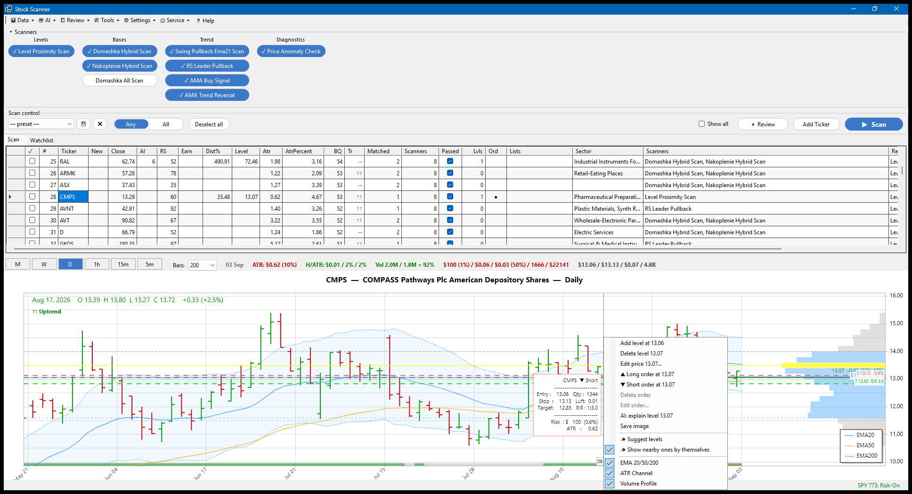
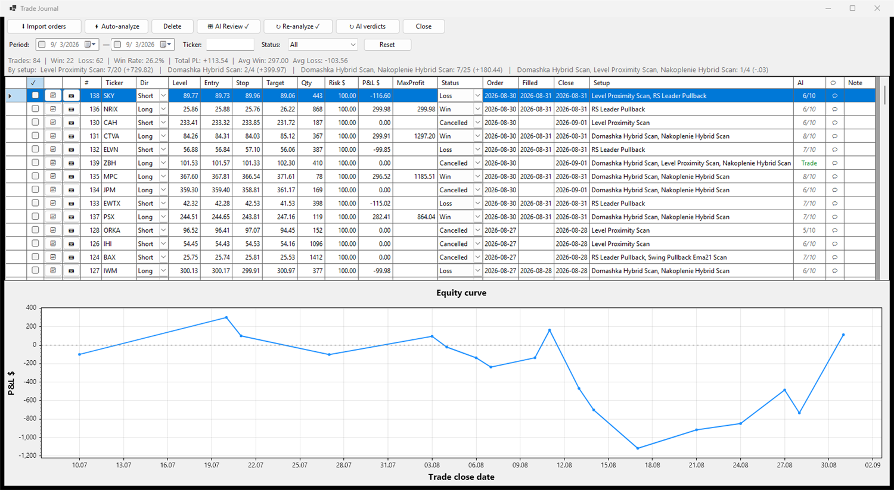
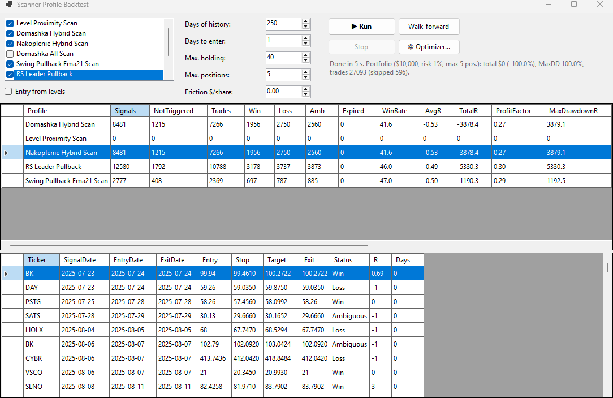
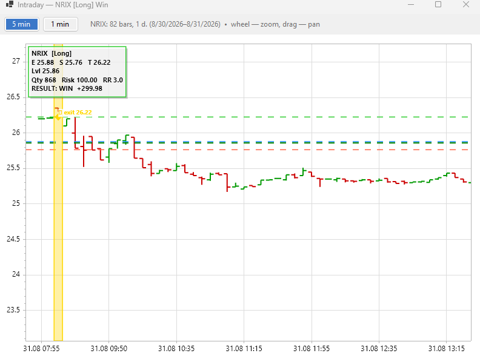

# Stock Scanner

**Windows desktop app for picking US stocks to swing-trade: a scanner over ~13 000 tickers, with a backtester and a journal to check that the picks hold up.** Free, closed source, bring your own market-data key.

*Приложение для отбора американских акций под свинг: сканер по ~13 000 бумаг, а бэктест и журнал — чтобы проверить, чего отбор стоит. Бесплатно. Русское описание — ниже.*

**[⬇ Download the latest release](../../releases/latest)**

*Scan across ~13 000 US tickers, and the chart of the selected one with hand-drawn levels and a virtual order.*

*The journal: every trade attributed to the scanner that found it, resolved against minute bars, with an equity curve and per-setup statistics.*

*Backtest of the scanner profiles: day by day, no look-ahead, walk-forward and a portfolio simulation. It reports what the rules actually did — losing runs included.*

*Any closed trade replayed on minute bars: the entry window, stop and target, and where the position actually left. Daily bars cannot tell which level was hit first — this can.*

---

## English

### What it does

- **Scanner** over ~13 000 US stocks — the part everything else serves — with configurable JSON profiles: base/consolidation, EMA pullbacks, adaptive MA signals, relative-strength rank, trend template, dollar-volume, earnings-date and gap filters.
- **Backtester**: day-by-day simulation with no look-ahead, entry/stop/target mechanics, walk-forward (3 windows), portfolio simulation, grid-search parameter optimizer.
- **Trade journal** with per-setup attribution, equity curve, automatic order analysis down to minute bars, chart snapshots; **paper-trading** mode auto-creates virtual orders from scan signals.
- **Automation**: daily autopilot (update → scan → notification), price-level alerts.
- **AI assistant** (any OpenAI-compatible endpoint): setup scoring, entry/stop/target suggestions, morning briefing, per-ticker chat.
- **Charts**: daily/weekly/intraday (1m/5m/15m/1h), hand-drawn levels, virtual orders, EMA/ATR/Volume Profile; ThinkOrSwim export.
- Interface in English, Russian and Ukrainian.

### Install

1. Download `StockScanner-vX.Y.Z-win-x64.zip` from [Releases](../../releases/latest).
2. Unpack it anywhere — for example `C:\Apps\StockScanner`. **No installer, no .NET runtime needed**: the build is self-contained.
3. Run `StockScanner.App.exe`.

Windows SmartScreen will warn you that the publisher is unknown — the build is not code-signed. Click **More info → Run anyway**, or unblock the archive before unpacking (right-click → Properties → Unblock).

To update: download the new archive and unpack it over the old folder. Your data (journal, levels, watchlists, quotes database) lives outside the application folder and survives updates.

### First run

On the first run the app asks where to keep your data (next to the executable by default) and offers to load a demo market — fictional tickers DEMO01…DEMO24 with generated prices — so you can look around without a data key. For real quotes you need your own key: pick a provider in **⚙ Settings → 🔑 Data & API keys**:

| Provider | Cost | Notes |
|---|---|---|
| **Alpaca** | free key | full US history, IEX feed |
| **Schwab** | free for Schwab/ThinkOrSwim clients | OAuth, App Key from developer.schwab.com |
| **Massive** (ex-Polygon.io) | paid | fastest bulk path: the whole universe as one file per day |

Then: **Data → Update quotes**, pick scanners, press **▶ Scan**. Everything else is described in **❓ Help** inside the app.

An OpenAI-compatible key (OpenAI, OpenRouter, a local model) is optional and only needed for the AI features.

### What leaves your machine

Nothing goes to the author: there is no telemetry, no accounts, no servers of ours. The application talks only to the data provider whose key you entered, and — if you enabled AI — to the AI endpoint you configured. Quotes, your journal and your levels are stored locally in SQLite files.

### Disclaimer

Educational tool, not financial advice. Backtest and AI results do not guarantee future returns. Trading involves risk of loss; every decision is yours. Terms of use: see [LICENSE](LICENSE).

---

## Русский

### Что это

Десктоп-приложение (Windows) для **отбора американских акций** под свинг. Сканер — главное; остальное к нему приложено, чтобы отбор было чем проверить: **скан → отбор → виртуальный ордер → журнал → бэктест**. Бесплатно, исходный код закрыт.

| Блок | Что умеет |
|---|---|
| **Сканер** | ~13 000 акций, профили в JSON: базы, откаты к EMA21, AMA-сигналы, RS-ранг, трендовый шаблон, долларовый объём, фильтр гэпов, фильтр «не входить перед отчётом» |
| **Бэктест** | посуточный прогон без заглядывания в будущее, walk-forward, портфельная симуляция, оптимизатор порогов |
| **Журнал** | атрибуция сделок к сканерам, кривая доходности, автоанализ ордеров вплоть до минутных баров, снимки графиков, фильтр по периоду, тикеру и статусу |
| **Paper-trading** | автосоздание виртуальных ордеров по сигналам профиля |
| **Автоматизация** | автопилот (данные → скан → уведомление), алерты у нарисованных уровней |
| **AI** | оценки сетапов, цели Entry/Stop/Target, утренний брифинг, чат по тикеру |
| **Графики** | день/неделя/интрадей (1m/5m/15m/1h), уровни, ордера, EMA/ATR-канал/Volume Profile, экспорт в ThinkOrSwim |

Интерфейс: русский, английский, украинский.

### Установка

1. Скачайте `StockScanner-vX.Y.Z-win-x64.zip` в разделе [Releases](../../releases/latest).
2. Распакуйте в любую папку, например `C:\Apps\StockScanner`. **Установщик и .NET не нужны** — сборка самодостаточная.
3. Запустите `StockScanner.App.exe`.

Windows SmartScreen скажет, что издатель неизвестен: сборка не подписана сертификатом. Нажмите **Подробнее → Выполнить в любом случае** или снимите блокировку с архива до распаковки (правой кнопкой → Свойства → Разблокировать).

Обновление: скачать новый архив и распаковать поверх старой папки. Данные (журнал, уровни, списки, база котировок) лежат вне папки приложения и обновление переживают.

### Первый запуск

При первом запуске приложение спросит, где хранить данные (по умолчанию — папка рядом с ним), и предложит загрузить демо-рынок: вымышленные тикеры DEMO01…DEMO24 со сгенерированными ценами, чтобы осмотреться без ключа. Для настоящих котировок нужен свой ключ, источник выбирается в **⚙ Настройки → 🔑 Данные и ключи API**:

- **Alpaca** — бесплатный ключ, вся история США (фид IEX);
- **Schwab** — бесплатно клиентам Schwab/ThinkOrSwim, OAuth;
- **Massive** (бывш. Polygon.io) — платно, самый быстрый путь: вся вселенная одним файлом в день. Нужны две разные пары ключей: `API Key` и отдельные `S3 Access Key` + `Secret Key` для flat-files.

Дальше: **Данные → Обновить котировки**, отметить сканеры, **▶ Scan**. Остальное — в **❓ Справке** внутри приложения.

Ключ OpenAI-совместимого API нужен только для AI-функций и не обязателен.

### Что уходит с вашей машины

Автору — ничего: телеметрии нет, аккаунтов нет, наших серверов нет. Приложение обращается только к поставщику данных, чей ключ вы ввели, и — если включили AI — к указанному вами AI-endpoint. Котировки, журнал и уровни лежат локально в файлах SQLite.

### Отказ от ответственности

Инструмент технического анализа для образовательных целей. Не инвестиционная рекомендация. Результаты бэктестов и разборов модели не гарантируют будущую доходность. Торговля связана с риском потери капитала; решения вы принимаете сами. Условия использования — [LICENSE](LICENSE).
